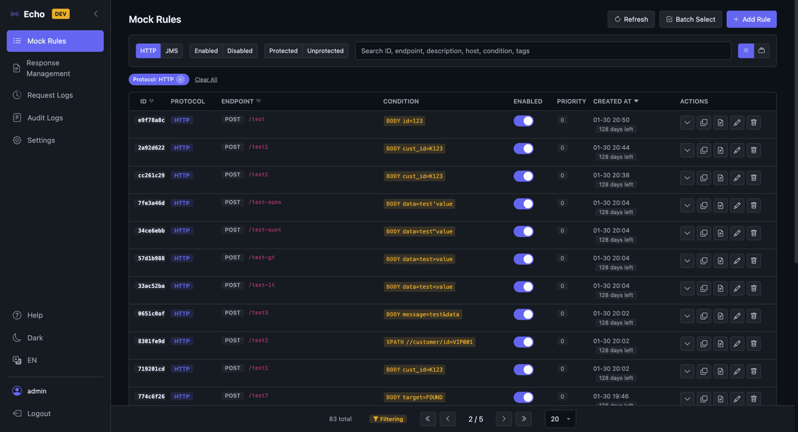

# Echo Mock Server

[](https://github.com/boloagegit/echo-mock-server/actions/workflows/ci.yml)
[](https://github.com/boloagegit/echo-mock-server/actions/workflows/push-docker.yml)
  

[中文版 README](README_zh-TW.md)

An enterprise-grade dual-protocol mock server supporting HTTP and JMS, designed for simulating API responses in development and testing environments.

## Screenshot



## Features

- **Dual Protocol Support** – HTTP REST API and JMS (Artemis) message queues
- **JMS Proxy** – Forwards to TIBCO EMS or Artemis ESB when no matching rule is found
- **Condition Matching** – Returns different responses based on Body (JSON/XML), Query, and Header conditions
- **Tag-Based Organization** – Classify rules with JSON tags (`key:value`), batch enable/disable by tag
- **Response Management** – Manage response content independently; multiple rules can share a single response, with export/import support
- **SSE Streaming** – Server-Sent Events support with editable event sequences, loop modes, and live preview
- **Dynamic Templates** – WireMock-style Handlebars template engine with conditionals, loops, JSONPath/XPath
- **Proxy Forwarding** – Automatically forwards to the original host when no matching rule is found
- **Visual Management** – Dark/Light theme Web UI with responsive design (RWD)
- **Batch Operations** – Export/import rules and responses, batch delete (ADMIN only)
- **Excel Import** – Batch import rules via Excel with downloadable template
- **Audit Trail** – Track rule change history with automatic cleanup of expired records
- **Statistics & Monitoring** – Real-time request statistics and hit rate tracking with auto-refresh and idle detection
- **High Performance** – 4K+ RPS (JSON), XML/XPath matching 14x faster than WireMock at scale (2,000 rules)
- **Access Control** – Admin/User role separation with LDAP authentication support and built-in account management
- **Built-in Accounts** – Account CRUD, enable/disable, password reset, forgot password, self-registration
- **Remember Me** – Long-lived login sessions, synced with session timeout (default 180 days)
- **Rule Protection** – Mark rules as protected to prevent automatic cleanup
- **Rule Extension** – Extend retention period for rules/responses to avoid scheduled cleanup
- **Orphan Cleanup** – Detect and remove orphan responses not used by any rule
- **Auto Backup** – Scheduled H2 database backup, shutdown backup, and manual trigger
- **Stateful Scenarios** – WireMock-style state machine for simulating multi-step workflows (e.g., order → payment → confirmation)
- **Fault Injection** – Simulate connection reset and empty response for resilience testing
- **Faker Data** – Built-in fake data helpers (name, email, phone, address, etc.) for realistic mock responses
- **Rule Testing** – Test rule matching directly from the admin UI
- **Static Analysis** – SpotBugs code analysis
- **Zero External Dependencies** – Embedded H2 database and Caffeine cache
- **Intranet Friendly** – Frontend uses WebJars, no CDN required
- **Environment Identification** – Protocol aliases and environment labels for easy multi-environment deployment

## Quick Start

### Prerequisites

- Java 17+
- Gradle 8+ (or use the included wrapper)

### Start the Server

```bash
# Development mode
./gradlew dev

# Default mode (login required: admin/admin)
./gradlew bootRun

# Build JAR
./gradlew bootJar
java -jar build/libs/echo-server-*.jar
```

### Docker Deployment

```bash
# Build and start
./gradlew bootJar
docker compose up -d

# Or pull directly (if pushed to a registry)
docker compose pull && docker compose up -d

# View logs
docker compose logs -f

# Stop
docker compose down
```

Environment variables:
| Variable | Default | Description |
|----------|---------|-------------|
| `ECHO_ADMIN_USERNAME` | admin | Admin username |
| `ECHO_ADMIN_PASSWORD` | admin | Admin password |
| `ECHO_ENV_LABEL` | DOCKER | Environment label |
| `TZ` | Asia/Taipei | Timezone |

JVM options are set in the Dockerfile (default `-Xms256m -Xmx512m`). Override by adding `JAVA_OPTS` to docker-compose.yml `environment`.

### Access the Service

| Service | URL | Description |
|---------|-----|-------------|
| Admin UI | http://localhost:8080/ | Mock rule management |
| Login Page | http://localhost:8080/login.html | User login |
| Mock Endpoint | http://localhost:8080/mock/** | Intercept HTTP requests |
| H2 Console | http://localhost:8080/h2-console | Database management |

## Rule Matching Priority

When multiple rules match the same request, the system selects based on the following order:

### Sorting Priority (higher number = higher priority)

1. **matchKey specificity** – Exact paths take priority over wildcard `*`
2. **priority field** – Higher number = higher priority (default 0)
3. **targetHost specificity** (HTTP) – Specified host takes priority over empty value
4. **Creation time** – Newer rules take priority

### Matching Logic

1. **Has conditions and matches** → Return immediately
2. **No conditions** → Record as fallback, take the first one after sorting
3. Finally return the fallback rule or null

### Example

| Rule | targetHost | matchKey | priority | Condition | Order |
|------|------------|----------|----------|-----------|-------|
| A | api.com | /users | 10 | type=vip | 1 |
| B | api.com | /users | 10 | (none) | 2 |
| C | (empty) | /users | 10 | (none) | 3 |
| D | api.com | * | 10 | (none) | 4 |
| E | api.com | /users | 1 | (none) | 5 |

- Request body contains `type=vip` → Matches A
- Request body does not contain `type=vip` → Matches B

Rules with disabled tags do not participate in matching.

## Tag-Based Organization

Tags are used to organize rules by version, feature, or environment:

- **JSON format** – e.g., `{"env":"prod","team":"payment"}`
- **Batch control** – Enable/disable rules by tag (`PUT /api/admin/rules/tag/{key}/{value}/enable|disable`)
- **Quick filter** – Filter rules by tag on the rules page, with group view toggle

## Mock Rule Configuration

### HTTP Rule

```json
{
  "protocol": "HTTP",
  "targetHost": "api.example.com",
  "matchKey": "/users",
  "method": "GET",
  "bodyCondition": "custId=K123",
  "queryCondition": "status=active",
  "responseBody": "{\"name\": \"VIP User\"}",
  "httpStatus": 200,
  "delayMs": 100
}
```

### JMS Rule

```json
{
  "protocol": "JMS",
  "queueName": "ORDER.QUEUE",
  "bodyCondition": "//OrderType=VIP",
  "responseBody": "<response><status>OK</status></response>",
  "delayMs": 50
}
```

## JMS Architecture

Echo can act as a JMS Proxy, intercepting JMS messages in development environments:

```
Application ──JMS──▶ Echo (Artemis)  ──JMS──▶ ESB (TIBCO/Artemis)
                     Queue: ECHO.REQUEST      Queue: TARGET.REQUEST
                     Match found → Mock Response
                     No match    → Forward to Target ESB
```

## Condition Matching Syntax

### HTTP Body Conditions (JSON)

| Syntax | Description | Example |
|--------|-------------|---------|
| `field=value` | Simple field | `userId=123` |
| `a.b.c=value` | Nested field | `order.customer.id=VIP001` |
| `arr[0].field=value` | Array index | `items[0].sku=A001` |

### HTTP Query Conditions

| Syntax | Description | Matches |
|--------|-------------|---------|
| `status=active` | Query parameter | `?status=active` |
| `id=123` | Query parameter | `?id=123&other=x` |

### JMS Body Conditions (XML)

| Syntax | Description |
|--------|-------------|
| `element=value` | Simple element (auto-converts to `//element`) |
| `//CustomerId=K123` | XPath anywhere |
| `/root/order/id=123` | XPath absolute path |

### Multiple Conditions

Multiple conditions separated by `;` must all match (AND logic):
- Body: `custId=K123;type=vip`
- Query: `status=active;page=1`
- Header: `X-Api-Key=abc123;Content-Type*=json`

### HTTP Header Conditions

| Syntax | Description | Example |
|--------|-------------|---------|
| `Header=value` | Exact match (case-insensitive) | `X-Api-Key=abc123` |
| `Header!=value` | Not equal | `Accept!=text/xml` |
| `Header*=value` | Contains | `Content-Type*=json` |
| `Header~=regex` | Regex match | `Authorization~=Bearer.*` |

## Stateful Scenarios

Simulate multi-step workflows using WireMock-style state machines. Each scenario has a `scenarioName` and a `currentState` (default: `Started`).

Rules use three fields to control state:
- `scenarioName` – Which state machine this rule belongs to
- `requiredScenarioState` – Rule only matches when the scenario is in this state
- `newScenarioState` – After matching, transition the scenario to this state

### Example: Order Flow

```bash
# Rule 1: In "Started" state, GET returns pending
curl -X POST http://localhost:8080/api/admin/rules -u admin:admin \
  -H 'Content-Type: application/json' -d '{
    "protocol":"HTTP", "matchKey":"/order/123", "method":"GET",
    "responseBody":"{\"status\":\"pending\"}", "status":200, "priority":10,
    "scenarioName":"order-flow", "requiredScenarioState":"Started", "newScenarioState":"Started"
  }'

# Rule 2: In "Started" state, POST /pay transitions to "Paid"
curl -X POST http://localhost:8080/api/admin/rules -u admin:admin \
  -H 'Content-Type: application/json' -d '{
    "protocol":"HTTP", "matchKey":"/order/123/pay", "method":"POST",
    "responseBody":"{\"result\":\"payment-ok\"}", "status":200, "priority":10,
    "scenarioName":"order-flow", "requiredScenarioState":"Started", "newScenarioState":"Paid"
  }'

# Rule 3: In "Paid" state, GET returns paid
curl -X POST http://localhost:8080/api/admin/rules -u admin:admin \
  -H 'Content-Type: application/json' -d '{
    "protocol":"HTTP", "matchKey":"/order/123", "method":"GET",
    "responseBody":"{\"status\":\"paid\"}", "status":200, "priority":10,
    "scenarioName":"order-flow", "requiredScenarioState":"Paid", "newScenarioState":"Paid"
  }'
```

```bash
curl http://localhost:8080/mock/order/123          # → {"status":"pending"}
curl -X POST http://localhost:8080/mock/order/123/pay  # → {"result":"payment-ok"}
curl http://localhost:8080/mock/order/123          # → {"status":"paid"}
```

### Reset Scenarios

```bash
# Reset a single scenario
curl -X PUT http://localhost:8080/api/admin/scenarios/order-flow/reset -u admin:admin

# Reset all scenarios
curl -X PUT http://localhost:8080/api/admin/scenarios/reset -u admin:admin
```

## Usage

### Direct Call

```bash
# Matching rule found → Return mock response
curl http://localhost:8080/mock/api/users \
  -H "X-Original-Host: api.example.com"

# No matching rule → Proxy forward to google.com
curl http://localhost:8080/mock/search?q=test \
  -H "X-Original-Host: google.com"
```

### Via Nginx Proxy

```nginx
location /api/ {
    proxy_set_header X-Original-Host api.example.com;
    proxy_pass http://echo-server:8080/mock/;
}
```

## Configuration

### application.yml

```yaml
server:
  port: 8080
  servlet:
    session:
      timeout: 180d

echo:
  env-label:                    # Environment label (e.g., DEV, SIT, UAT)
  remember-me:
    key: echo-remember-me-secret  # Remember Me encryption key
    validity: 180d                # Remember Me cookie validity
  admin:
    username: admin             # Admin username
    password: admin             # Admin password (supports {bcrypt} prefix)
  storage:
    mode: database              # database or file
  cache:
    body:
      max-size-mb: 50           # Response body cache limit (MB)
      threshold-kb: 5120        # Bodies larger than this are not cached (KB)
      expire-minutes: 720       # Cache expiration (minutes)
    sync-interval-ms: 5000      # Multi-instance cache sync interval (ms)
  jms:
    enabled: false              # Set to true to enable JMS
    port: 61616                 # Artemis listen port
    queue: ECHO.REQUEST         # Queue to listen on
    endpoint-field: ServiceName # Field to extract endpoint identifier from message body
    target:
      enabled: false            # Set to true to enable forwarding to ESB
      type: tibco               # artemis or tibco
      server-url: tcp://esb-server:7222
      timeout-seconds: 30
      queue: TARGET.REQUEST     # Target queue
  http:
    alias: HTTP                 # HTTP protocol display name
  stats:
    retention-days: 7           # Statistics retention days
  request-log:
    store: database             # memory or database
    max-records: 10000          # Maximum log records
    include-body: true          # Whether to log request/response body
    max-body-size: 65536        # Body log size limit (bytes)
  audit:
    retention-days: 30          # Audit log retention days
  cleanup:
    enabled: true               # Enable scheduled cleanup
    cron: "0 0 3 * * *"         # Daily at 3 AM
    rule-retention-days: 180    # Rule retention days
    response-retention-days: 180 # Response retention days
  backup:
    enabled: true               # Enable H2 auto backup
    cron: "0 0 3 * * *"         # Daily at 3 AM
    path: ./backups             # Backup directory
    retention-days: 7           # Backup retention days
    on-shutdown: true           # Backup on application shutdown
  builtin-account:
    self-registration: false    # Set to true to allow self-registration
  ldap:
    enabled: false
    url: ldap://ldap.example.com:389
    base-dn: dc=example,dc=com
    user-pattern: uid={0},ou=users
```

## Authentication

### Auth Modes

| Profile | Description | Use Case |
|---------|-------------|----------|
| `dev` | Dev mode, no login required, self-registration enabled | Local development |
| `default` | Login required, default account admin/admin | Test environments |
| LDAP | LDAP authentication (`echo.ldap.enabled=true`) | Production |

### Access Control

| Role | Permissions |
|------|-------------|
| ADMIN | System settings, batch operations (export/import/delete all), account management |
| USER | Manage mock rules, view statistics and logs, change own password |
| Guest | Read-only browsing of rules, responses, statistics, audit logs (no login required) |

### Built-in Account Management

ADMIN can manage built-in accounts via the admin UI:
- Create/delete accounts
- Enable/disable accounts
- Reset password (generates temporary password, forces change on first login)
- Users can change their own password (`PUT /api/account/change-password`)
- Forgot password request (public endpoint, rate-limited)
- Self-registration (requires `echo.builtin-account.self-registration=true`)

## API Endpoints

### Rule Management

| Method | Path | Description |
|--------|------|-------------|
| GET | /api/admin/rules | List all rules |
| GET | /api/admin/rules/{id} | Get rule (with response body) |
| POST | /api/admin/rules | Create rule |
| PUT | /api/admin/rules/{id} | Update rule |
| DELETE | /api/admin/rules/{id} | Delete rule |
| POST | /api/admin/rules/{id}/test | Test rule matching |
| PUT | /api/admin/rules/{id}/enable | Enable rule |
| PUT | /api/admin/rules/{id}/disable | Disable rule |
| PUT | /api/admin/rules/{id}/protect | Protect rule |
| PUT | /api/admin/rules/{id}/unprotect | Unprotect rule |
| PUT | /api/admin/rules/{id}/extend | Extend rule retention |
| PUT | /api/admin/rules/batch/enable | Batch enable |
| PUT | /api/admin/rules/batch/disable | Batch disable |
| PUT | /api/admin/rules/batch/protect | Batch protect |
| PUT | /api/admin/rules/batch/unprotect | Batch unprotect |
| PUT | /api/admin/rules/batch/extend | Batch extend |
| PUT | /api/admin/rules/tag/{key}/{value}/enable | Enable by tag (ADMIN) |
| PUT | /api/admin/rules/tag/{key}/{value}/disable | Disable by tag (ADMIN) |
| GET | /api/admin/rules/export | Export all rules (ADMIN) |
| GET | /api/admin/rules/{id}/json | Export single rule |
| POST | /api/admin/rules/import | Import single rule (ADMIN) |
| POST | /api/admin/rules/import-batch | Batch import (ADMIN) |
| POST | /api/admin/rules/import-excel | Excel import (ADMIN) |
| GET | /api/admin/rules/import-template | Download Excel import template |
| DELETE | /api/admin/rules/batch | Batch delete (ADMIN) |
| DELETE | /api/admin/rules/all | Delete all (ADMIN) |

### Response Management

| Method | Path | Description |
|--------|------|-------------|
| GET | /api/admin/responses | List responses (supports keyword search) |
| GET | /api/admin/responses/summary | Response summary (with usage count) |
| GET | /api/admin/responses/{id} | Get response |
| GET | /api/admin/responses/{id}/rules | Rules using this response |
| POST | /api/admin/responses | Create response |
| PUT | /api/admin/responses/{id} | Update response |
| DELETE | /api/admin/responses/{id} | Delete response (cascades to associated rules) |
| PUT | /api/admin/responses/{id}/extend | Extend response retention |
| PUT | /api/admin/responses/batch/extend | Batch extend responses |
| GET | /api/admin/responses/orphan-count | Orphan response count |
| DELETE | /api/admin/responses/orphans | Delete orphan responses |
| GET | /api/admin/responses/export | Export all responses (ADMIN) |
| POST | /api/admin/responses/import-batch | Batch import responses (ADMIN) |
| DELETE | /api/admin/responses/batch | Batch delete responses (ADMIN) |
| DELETE | /api/admin/responses/all | Delete all responses (ADMIN) |

### Log Queries

| Method | Path | Description |
|--------|------|-------------|
| GET | /api/admin/logs | Request logs (filter by ruleId/protocol/matched/endpoint) |
| GET | /api/admin/logs/summary | Request log summary |
| DELETE | /api/admin/logs/all | Delete all request logs (ADMIN) |
| GET | /api/admin/rules/{id}/audit | Audit logs for a rule |
| GET | /api/admin/audit | All audit logs |
| DELETE | /api/admin/audit/all | Delete all audit logs (ADMIN) |

### System Management

| Method | Path | Description |
|--------|------|-------------|
| GET | /api/admin/status | System status (JVM, DB, statistics) |
| GET | /api/admin/backup/status | Backup status and file list |
| POST | /api/admin/backup | Trigger manual backup |

### Account Management

| Method | Path | Description |
|--------|------|-------------|
| GET | /api/admin/builtin-users | List built-in accounts (ADMIN) |
| POST | /api/admin/builtin-users | Create account (ADMIN) |
| PUT | /api/admin/builtin-users/{id}/enable | Enable account (ADMIN) |
| PUT | /api/admin/builtin-users/{id}/disable | Disable account (ADMIN) |
| DELETE | /api/admin/builtin-users/{id} | Delete account (ADMIN) |
| POST | /api/admin/builtin-users/{id}/reset-password | Reset password (ADMIN) |
| POST | /api/admin/builtin-users/forgot-password | Forgot password (public) |
| POST | /api/admin/builtin-users/register | Self-register (public, must be enabled) |
| PUT | /api/account/change-password | Change own password (authenticated) |

### Scenario Management

| Method | Path | Description |
|--------|------|-------------|
| PUT | /api/admin/scenarios/{name}/reset | Reset a single scenario to Started |
| PUT | /api/admin/scenarios/reset | Reset all scenarios to Started |

### JMS Testing

| Method | Path | Description |
|--------|------|-------------|
| POST | /api/admin/jms/test | Send test message to ECHO.REQUEST |

## Dynamic Response Templates

WireMock-style Handlebars template engine. Use `{{...}}` syntax in response content to generate dynamic content.

### Basic Syntax

```handlebars
{{request.path}}                              // Request path
{{request.method}}                            // HTTP method
{{request.query.xxx}}                         // Query parameter
{{request.headers.xxx}}                       // Header value
{{{request.body}}}                            // Request body
{{now format='yyyy-MM-dd'}}                   // Formatted time
{{randomValue type='UUID'}}                   // Random UUID
{{randomValue length=8 type='ALPHANUMERIC'}}  // Random string
```

### Conditions & Loops

```handlebars
{{#if (eq request.method 'POST')}}Created{{else}}Other{{/if}}
{{#each (split request.query.ids ',')}}{{this}}{{/each}}
```

Comparison operators: `eq`, `ne`, `gt`, `lt`, `contains`, `matches`

### Faker Data Helpers

```handlebars
{{randomFirstName}}                           // Random first name
{{randomLastName}}                            // Random last name
{{randomFullName}}                            // Random full name
{{randomEmail}}                               // Random email
{{randomPhoneNumber}}                         // Random phone (xxx) xxx-xxxx
{{randomCity}}                                // Random city
{{randomCountry}}                             // Random country
{{randomStreetAddress}}                       // Random street address
{{randomInt min=1 max=100}}                   // Random integer in range
```

### JSONPath / XPath

```handlebars
{{jsonPath request.body '$.user.name'}}
{{xPath request.body '//name/text()'}}
```

## Multi-Instance Deployment

Database mode supports multi-instance deployment with DB-based cache invalidation.

### Cache Sync Mechanism

Each instance uses local Caffeine cache, synchronized via the `cache_events` table:

```
Instance A modifies rule → Writes to cache_events (RULE_CHANGED)
                                    ↓
Instance B polls every N seconds → Finds new event → Clears local cache
```

- **Polling interval**: Default 5 seconds, configurable via `echo.cache.sync-interval-ms`
- **Event cleanup**: Automatically cleans events older than 10 minutes every hour
- **Performance impact**: Minimal — each poll is a simple timestamp query

### Configuration Example

```yaml
echo:
  storage:
    mode: database
  cache:
    sync-interval-ms: 10000  # Change to 10 seconds (default 5000)

spring:
  datasource:
    url: jdbc:postgresql://db-host:5432/echo  # Shared database
```

### Activation Conditions

- `echo.storage.mode=database` → Enables cache sync
- `echo.storage.mode=file` → Disabled (not needed for single instance)

## Performance Benchmark

Test environment: macOS, Apple Silicon, Java 17, 20 concurrent threads, 10 seconds per scenario.

### Rule Count Impact (1,600 rules)

| Metric | 6 rules | 1,600 rules |
|--------|---------|-------------|
| Cold cache match | 3 ms | 10 ms |
| Warm cache match | 3 ms | 6 ms |
| 10-request average | — | 5.0 ms |

Rule count has minimal impact on matching performance. Rules are cached by `host + path + method`, so only candidate rules for the same endpoint are evaluated — not all 1,600.

### XML Body Size Impact

| Body Size | XML Match | JSON Match | XML / JSON |
|-----------|-----------|------------|------------|
| ~1KB | 16.2 ms | 5.2 ms | 3.1x |
| ~10KB | 10.0 ms | 3.8 ms | 2.6x |
| ~50KB | 23.4 ms | 4.2 ms | 5.6x |
| ~100KB | 34.8 ms | 6.0 ms | 5.8x |

XML matching cost grows linearly with body size due to DOM parsing. JSON matching remains stable (~4-6ms) regardless of body size thanks to Jackson's O(1) field lookup.

### Cache Mechanism

- **Rule cache**: Caffeine, 10,000 entries, 12-hour expiration
- **Response body cache**: 50MB limit, 5MB threshold, 12-hour expiration
- Automatically invalidated on rule changes

### High-Volume Rule Matching (2,000 rules, worst case)

Test: 2,000 HTTP rules with XPath conditions (`//ServiceName=xxx;//CustId=yyy`), target rule sorted last (worst case full traversal), 10 concurrent threads, 200 requests.

| Scenario | RPS | avg | p50 | p95 | p99 |
|----------|-----|-----|-----|-----|-----|
| Echo XML (2,000 rules, XPath) | 434 | 22.7ms | 22.6ms | 34.8ms | 47.0ms |
| Echo JSON (2,000 rules, field match) | 1,066 | 9.3ms | 8.0ms | 24.8ms | 28.7ms |
| WireMock XML (2,000 rules, XPath) | 31 | 311.9ms | 311.3ms | 400.7ms | 427.0ms |

Echo's XML/XPath matching is **14x faster** than WireMock at scale, thanks to `getElementsByTagName` fast path for simple XPath patterns and pre-compiled `XPathExpression` caching. JSON matching is even faster (1,066 RPS) due to Jackson's O(1) hash lookup.

### Run Benchmarks

```bash
# Single scenario match time
python3 scripts/stress-test-scenario1.py

# 1,600 rules impact test
python3 scripts/stress-test-1600-rules.py

# XML vs JSON body size comparison
python3 scripts/stress-test-xml-body.py

# RPS throughput test
python3 scripts/stress-test-rps.py [URL] [DURATION] [CONCURRENCY]

# Echo vs WireMock comparison (requires libs/wiremock-standalone.jar)
python3 scripts/stress-test-vs-wiremock.py [ECHO_URL] [WM_URL] [DURATION] [CONCURRENCY]

# 2,000 JMS rules match time
python3 scripts/bench-2000-jms.py

# JMS match stress test
python3 scripts/stress-test-jms-match.py [BASE_URL]

# Memory stress test
python3 scripts/stress-test-memory.py [BASE_URL]

# Cache isolation stress test
python3 scripts/stress-test-cache-isolation.py

# Match scenario regression test (138 cases)
python3 scripts/test-match-scenarios.py
```

## Testing

```bash
# Run tests
./gradlew test

# Quick test (alias)
./gradlew t

# Test coverage report
./gradlew test jacocoTestReport
# Report location: build/reports/jacoco/test/html/index.html
```

## Tech Stack

| Category | Technology |
|----------|-----------|
| Framework | Spring Boot 3.5.13 |
| Web Server | Undertow |
| Database | H2 (Embedded) |
| Cache | Caffeine |
| Messaging | Artemis (Embedded) |
| Security | Spring Security |
| Template | Handlebars 4.5 |
| JSON Path | JsonPath 2.10 |
| Excel | Apache POI |
| Static Analysis | SpotBugs |
| Frontend | Vue.js 3.5 + Bootstrap 5.3 + Bootstrap Icons 1.13 + CodeMirror 5 (WebJars) |
| Build | Gradle 8 |

## License

MIT License
